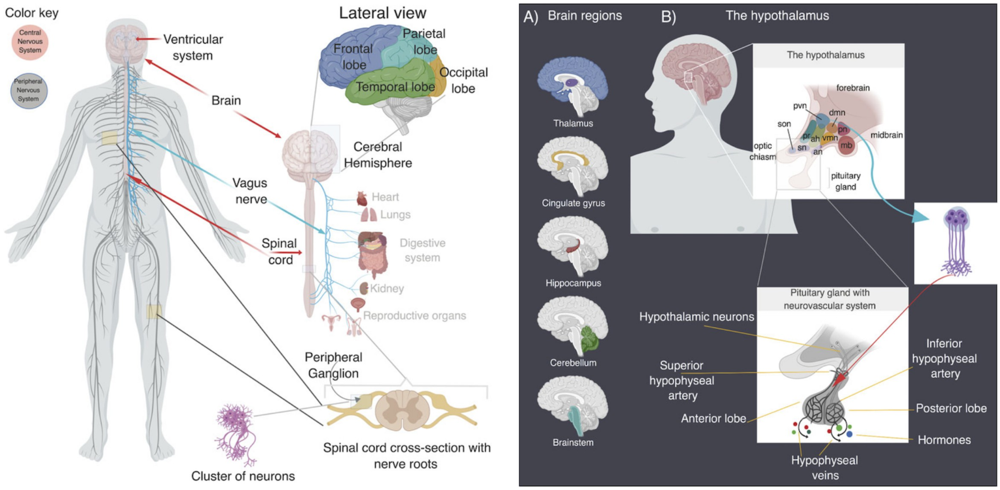
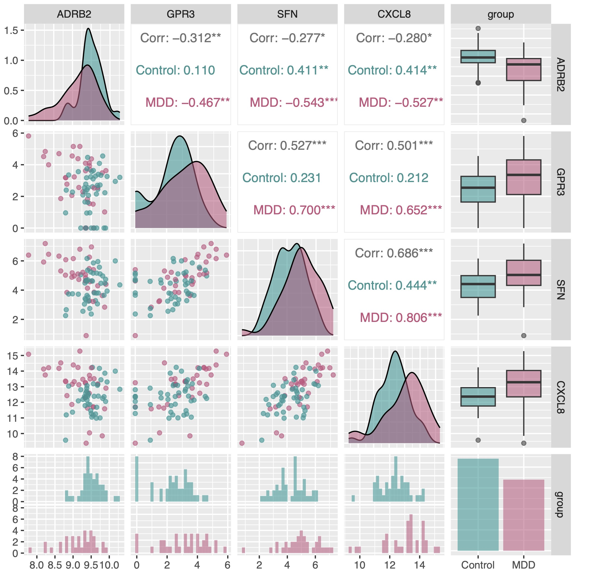
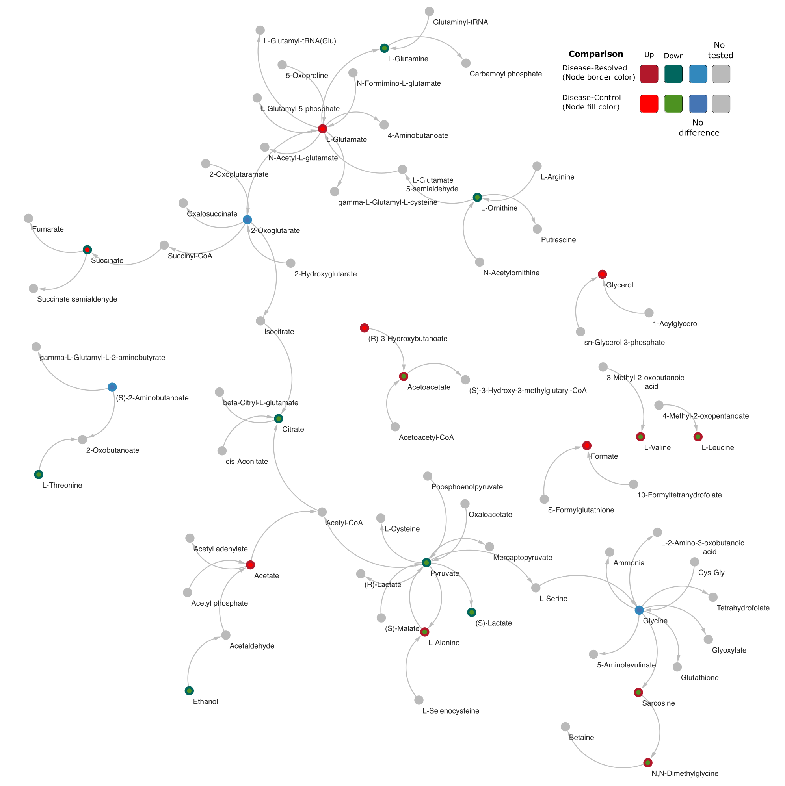
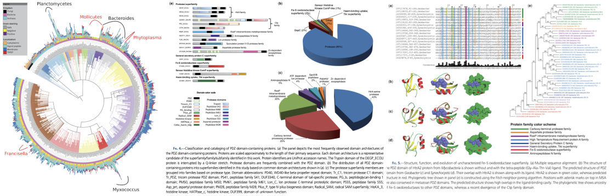
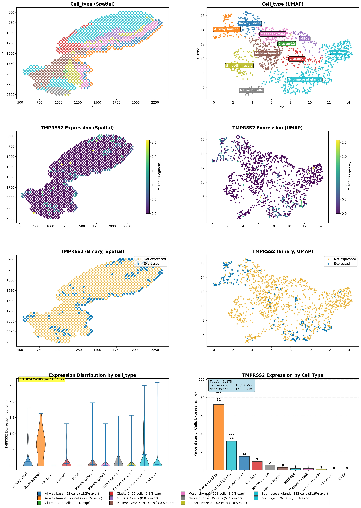

```{r, echo=FALSE}
options(kableExtra.latex.load_packages = FALSE)
knitr::opts_chunk$set(echo = TRUE)
options(knitr.table.format = function() {
  if (knitr::is_latex_output()) 'latex' else 'pandoc'})

```


# From Biological Data to Biological Discovery

Modern biology produces enormous amounts of data — genomes, gene expression, single-cell profiles, protein interactions, metabolic pathways, and drug responses. Each dataset provides only a partial view of how living systems work. Important biological mechanisms often become visible only when these different layers are considered **together**.

My research develops computational approaches that integrate heterogeneous biological information to identify **biological relationships, regulatory mechanisms, and molecular control points that can be experimentally tested**. Rather than treating each dataset as isolated evidence, I aim to reconstruct biological systems across multiple levels of organization:

**molecules → interactions → networks → pathways → cellular states → tissues → disease**

This systems-level view provides a framework for moving from large-scale biological data toward experimentally testable hypotheses and, ultimately, applications in medicine and biotechnology.

---

## 1. Integrated Biological Discovery

A central direction of my research is the development and application of computational methods for **integrating diverse biological datasets**. Depending on the biological question, this can involve:

* Genomic and protein sequences
* Gene-expression and transcriptomic datasets
* Single-cell RNA sequencing
* Gene regulatory networks
* Protein–protein interaction networks
* Metabolic networks
* Drug–gene relationships
* Disease-associated molecular signatures
* Publicly available biological databases and literature

The objective is not simply to identify differentially expressed genes or individual molecular associations. Instead, I seek to determine **how multiple biological components work together and which components exert disproportionate influence on a biological system**. Such analyses can reveal molecular targets, regulatory factors, pathway vulnerabilities, biomarkers, and mechanisms that may not be apparent from any single dataset.

---

## 2. Gene Regulation, Cellular States, and Reprogramming

Gene expression is a dynamic property of biological systems. Cellular identity and function arise from the coordinated regulation of thousands of genes rather than from individual genes acting in isolation.

{#fig-exp1 width="7.5in"}

My work investigates gene regulation at the level of **regulatory networks and cellular states**. I have developed and applied computational approaches for studying transcriptional regulation, including large-scale analysis of gene regulatory relationships and machine-learning-based network inference ([Muley and Koenig. Biochimie. 2022](https://doi.org/10.1016/j.biochi.2021.10.016)).

Current work extends this framework toward **transcription-factor influence and cellular-state transitions**. Rather than relying exclusively on previously established transcription-factor/target relationships, I aim to infer regulatory influence directly from large collections of gene-expression data. This provides an opportunity to identify combinations of regulatory factors associated with particular cellular states and to formulate experimentally testable hypotheses about how one cellular state may be transformed into another.

In the longer term, this work may contribute to computational strategies for **cellular reprogramming, engineered cell states, and organoid-based biological models**.

{#fig-sys1 width="5.5in"}

---

## 3. Networks, Evolution, and Brain–Body Communication

My research has a long-standing foundation in the computational analysis of **protein–protein interactions and molecular networks**, which help define the functional architecture of cellular systems. During my doctoral and subsequent research, I developed approaches for predicting functional associations between proteins using comparative genomics, evolutionary relationships, gene organization, expression patterns, and other biological signals, with applications to the reconstruction of cellular pathways and processes ([Muley and Ranjan. PLoS One. 2012](https://doi.org/10.1371/journal.pone.0042057); [2013](https://doi.org/10.1371/journal.pone.0054325)).

This work has progressed from studying interactions within individual organisms toward understanding how molecular interactions connect biological processes **across cells and tissues**. An important future direction is the study of **intercellular molecular communication**: how signals originating in one tissue influence molecular and cellular states elsewhere in the organism. This perspective is particularly relevant to complex processes involving the nervous system, immune system, and peripheral tissues, where disease mechanisms cannot always be understood by studying a single organ in isolation.

{#fig-brain1 width="7.5in"}

A complementary strand of this work investigates **evolutionary and developmental neurobiology**. The assembly of the vertebrate brain relies on deeply conserved developmental programs that undergo lineage-specific divergence to shape distinct structural identities ([Muley et al. Encyclopedia of Religious Psychology and Behavior. 2019](https://doi.org/10.1007/978-3-319-47829-6_587-1)). By comparing early telencephalon development in mouse and chick embryos, we revealed a broadly conserved transcriptional architecture accompanied by critical, lineage-specific divergences in chromatin modifiers and transcriptional regulators during early patterning ([Muley et al. Progress in Neurobiology, 2020](https://doi.org/10.1016/j.pneurobio.2019.101735)). Many of these species-specific regulatory components overlap with risk genes for human neurodevelopmental disorders, providing insight into how evolutionary changes in early brain development may contribute to disease susceptibility.

{#fig-brain1 width="7.5in"}

Building on these comparative foundations, I am developing computational frameworks to trace how early developmental trajectories change across the human lifespan and become disrupted in neuropsychiatric disease. By examining how perturbed neurodevelopmental programs may influence brain–body signaling, and by tracing the evolutionary history of the protein domains involved in these processes, this work connects comparative embryology, disease genetics, and evolutionary systems biology.

**Enhancer transcription and blood–brain molecular communication** provides one example of this integrative approach. Gene regulation extends beyond conventional promoters and gene bodies, with many intergenic regions occupied and transcribed by RNA polymerase II. I investigated the transcriptional activity of 181,547 intergenic RNAPII-bound regions (iRNAPII-BRs) and their relationships with nearby genes in human peripheral blood ([Muley and Delahaye-Duriez. Comput Struct Biotechnol J. 2025](https://doi.org/10.1016/j.csbj.2025.11.060)). I found that iRNAPII-BRs were frequently associated with structurally complex genes present in isolation on chromosomes and showed strong transcriptional coordination with subsets of tissue-specific genes. Their transcriptional activity was particularly associated with immune and hematopoietic functions in blood, while a distinct group of nearby genes with neuronal functions showed gene expression despite limited transcriptional activity of their associated iRNAPII-BRs.

![Gene ontology enrichment analysis of six gene groups defined on the basis of three binary statuses concerning gene transcription, iRNAPII-BR transcription and whether the gene was linked to an iRNAPII-BR. The first digit of the group name indicates gene transcription status (1 = transcribed, 0 = not transcribed), the second digit indicates iRNAPII-BR transcription status (1 = transcribed, 0 = not transcribed), and the third digit indicates whether the gene is linked to an iRNAPII-BR (1 = linked, 0 = not linked). This classification assigned genes to six groups based on these binary combinations.](images/g23507.jpg){#fig-exp2 width="5in"}

I also identified changes in iRNAPII-BRs and nearby genes in major depressive disorder, including alterations involving ADRB2, CXCL8, SFN, and GPR3. These findings provide a starting point for investigating how regulatory processes detected in peripheral tissues may relate to molecular processes in the nervous system since these genes are fundamentally connected to the Hypothalamic-Pituitary-Adrenal (HPA) axis. Future work will extend this analysis across larger and more diverse transcriptomic datasets and integrate intergenic transcription with gene-regulatory and protein-interaction networks to investigate molecular processes involved in brain–peripheral tissue communication and their alteration in disease.

{#fig-exp3 width="5in"}

---

## 4. Metabolism, Protein Domains, and Biological Innovation

Metabolism provides another level at which biological systems can be studied computationally. I use **genome-scale metabolic reconstruction and network analysis** to investigate essential metabolic reactions, pathway dependencies, metabolic bottlenecks, network vulnerabilities, organism-specific metabolic capabilities, and potential intervention points. These approaches have applications ranging from fundamental microbial biology to therapeutic and industrial biotechnology.

One important direction is the identification of **pathogen-specific metabolic vulnerabilities** that could provide starting points for antimicrobial or antifungal discovery. The same principles can be applied to metabolic engineering, where computational identification of pathway bottlenecks and control points can guide the development of biologically produced compounds and other industrially relevant processes.

{#fig-pdz width="5.5in"}

From an evolutionary perspective, my earlier research investigated the **evolution and functional diversification of protein domains** across large collections of microbial genomes. This work included large-scale analysis of PDZ-domain-containing proteins across more than 1,400 microbial genomes and the identification of previously uncharacterized protein families and evolutionary relationships ([Muley, Akhter, Galande. Genome Biology and Evolution, 2019](https://doi.org/10.1093/gbe/evz023)).

{#fig-pdz width="7.5in"}

Current interests extend this comparative analysis to protein domains occurring across bacteria, archaea, eukaryotes, and viruses. A particular focus is the **haloacid dehalogenase (HAD) superfamily** — one of the most widely distributed and functionally diverse groups of phosphohydrolase-related proteins. Despite conservation of characteristic structural features, HAD proteins have diversified extensively in substrate specificity, domain organization, and biological function. I aim to characterize this diversity across more than 17,000 genomes spanning the three domains of cellular life and viruses, with emphasis on conserved and lineage-specific sequence features, evolutionary relationships, domain architectures, and functional diversification.

The broader objective is to understand **how molecular components evolve, acquire new functions, and become incorporated into increasingly complex biological systems**. Evolutionary information can provide useful constraints for interpreting molecular interactions, biological pathways, and functional innovation.

---

## 5. Systems Biology of Human Disease

Complex multi-system disorders — ranging from neuropsychiatric and neurodegenerative conditions to autoimmune and infectious diseases — arise from coordinated perturbations across transcriptional, proteomic, and intercellular networks. I use systems-level computational approaches to investigate these disease mechanisms by modelling gene expression with mathematical linear programming ([Muley. Methods in Molecular Biology. 2021](https://doi.org/10.1007/978-1-0716-1534-8_6)) and integrating large-scale transcriptomic architectures with dynamic regulatory interaction networks.

I have processed thousands of microarray, bulk RNA-seq, and single-cell datasets ([Muley. Methods in Molecular Biology. 2025](https://doi.org/10.1007/978-1-0716-4546-8_2)), enabling investigation of molecular changes across diverse human tissues, cell types, developmental trajectories, and pathological states. By integrating these data with protein–protein interaction networks, I aim to identify disease-associated genes, vulnerable functional sub-networks, and disrupted cellular processes within their biological context.

An important principle underlying this work is that **the most informative biological signal may not be present in any individual experiment**. It may emerge only through systematic comparison and integration of many independent datasets.

{#fig-pdz width="5.5in"}

My long-term research program maps **inter-organ molecular communication** — particularly the signaling axes linking the central nervous system to peripheral organ systems in development, health, and disease. By investigating intercellular protein networks and systemic processes that contribute to brain–body homeostasis, I aim to understand how localized molecular perturbations may produce broader systemic responses in complex disease states.

### From Biological Discovery to Translation

Across these research directions, my common objective is to use computation to identify biological relationships and control points that can be tested experimentally. By integrating molecular interactions, gene regulation, cellular states, metabolism, disease-associated molecular changes, and evolutionary information, I seek to reduce complex biological systems to mechanisms that are experimentally tractable.

This approach provides a foundation for moving from biological description toward intervention. Depending on the biological system, such discoveries may support therapeutic targets, antimicrobial strategies, engineered cellular states, biological models, or industrial biotechnology applications.

The long-term goal is not simply to analyse increasingly large biological datasets, but to develop computational approaches that help determine **which biological mechanisms matter, which can be manipulated, and which experiments are most likely to reveal something new**.


```{r echo=FALSE, eval=FALSE}
**Do you like our projects or have new ideas and passion for research ? Join our team**
```
