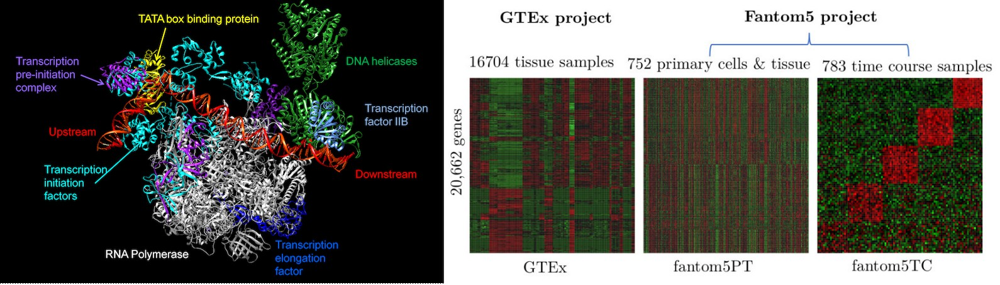

```{r, echo=FALSE}
options(kableExtra.latex.load_packages = FALSE)
knitr::opts_chunk$set(echo = TRUE)
options(knitr.table.format = function() {
  if (knitr::is_latex_output()) 'latex' else 'pandoc'})

```

<!-- This will be displayed in the page source code but not in the output. -->

We study how genomic information is transformed into functional cellular machinery and how this orchestration breaks down in human disease. By combining multi-omics data integration, network theory, and machine learning, our research pursues a central goal: **to uncover the dynamic principles of gene regulation and protein interactions with sufficient depth to enable precise, therapeutic cellular reprogramming.**

Our work spans five interconnected scales:

* **Regulatory Plasticity:** Mapping how transcription factor–gene networks adapt, rewire, and alter control strength across cellular contexts.
* **Cellular & Inter-Organ Interactomes:** Expanding protein–protein interaction networks from intracellular complexes to systemic, cross-tissue signaling pathways, with a focus on brain–body communication.
* **Evolutionary & Developmental Origins:** Tracking how conserved developmental networks undergo lineage-specific divergence to shape complex structures like the vertebrate brain.
* **Structural Architecture of Protein Domains:** Decoding how ancient, hyper-variable domain families evolve, diversify, and organize into functional interaction networks across the tree of life.
* **Systems Medicine & Therapeutic Reprogramming:** Integrating single-cell, bulk multi-omics, and network topology models to isolate disease mechanisms in complex neuropsychiatric, autoimmune, and infectious disorders.

## Mapping regulatory plasticity across the human transcriptome

While classical models often depict gene regulation as a static network of interactions between transcription factors and target genes ([Muley and Koenig. Biochimie. 2022](https://doi.org/10.1016/j.biochi.2021.10.016)), cellular identity and disease progression are ultimately driven by dynamic regulatory plasticity. Misregulation of transcriptional control leads to widespread pathological states, yet targeting individual genes in isolation offers limited therapeutic utility. Reprogramming gene expression requires systematically mapping the overarching genome-wide regulatory networks in which these genes function. By examining how transcription factor–gene relationships vary across diverse expression states, our research maps regulatory plasticity across the human transcriptome to capture the changing strength, direction, and organization of control networks across biological contexts. Distinguishing conserved regulatory programs from dynamically shifting interactions allows us to reframe transcriptional regulation as an adaptable, rewritable landscape rather than a fixed architecture. By connecting these dynamic transcriptional programs to the protein interaction networks that execute cellular function, our goal is to uncover how contextual regulatory shifts translate into functional outcomes and identify leverage points for directed cellular reprogramming.

{#fig-exp1 width="7.5in"}

## Enhancer transcription and blood–brain molecular communication

Gene regulation extends beyond conventional promoters and gene bodies, with many intergenic regions occupied and transcribed by RNA polymerase II. They more often overlap with enhancer elements. We investigated the transcriptional activity of 181,547 intergenic RNAPII-bound regions (iRNAPII-BRs) and their relationships with nearby genes in human peripheral blood ([*Muley and Delahaye-Duriez. Comput Struct Biotechnol J. 2025*](https://doi.org/10.1016/j.csbj.2025.11.060)). We found that iRNAPII-BRs were frequently associated with structurally complex genes present in isolation on chromosome and showed strong transcriptional coordination with subsets of tissue-specific genes. Their transcriptional activity was particularly associated with immune and hematopoietic functions in blood, while a distinct group of nearby genes with neuronal functions showed gene expression despite limited transcriptional activity of their associated iRNAPII-BRs. 

![Gene ontology enrichment analysis of six gene groups defined on the basis of three binary statuses concerning gene transcription, iRNAPII-BR transcription and whether the gene was linked to an iRNAPII-BR. The first digit of the group name indicates gene transcription status (1 = transcribed, 0 = not transcribed), the second digit indicates iRNAPII-BR transcription status (1 = transcribed, 0 = not transcribed), and the third digit indicates whether the gene is linked to an iRNAPII-BR (1 = linked, 0 = not linked). This classification assigned genes to six groups based on these binary combinations.](images/g23507.jpg){#fig-exp2 width="5in"}

We also identified changes in iRNAPII-BRs and nearby genes in major depressive disorder, including alterations involving ADRB2, CXCL8, SFN, and GPR3, highlighting the potential relevance of intergenic transcription to disease-associated molecular states.

![Coordinated expression of stress- and inflammation-related genes in major depressive disorder (MDD) and control samples. Panels a and b show principal component analysis of MDD and healthy control samples based on 500 highly variable tiRNAPII-BRs and genes. Panel c shows pairwise scatterplots and a correlation matrix of log₂-transformed expression levels for four genes—ADRB2, GPR3, SFN, and CXCL8—in MDD and healthy control samples. Each point represents one sample, color-coded by group. The lower panels show scatterplots with fitted trends; the diagonal panels show gene-wise expression density distributions; the upper panels show Pearson correlation coefficients. Boxplots (right) show the distribution of gene expression in control and MDD samples. Barplots show the frequency distribution for gene expression. MDD samples displayed a coordinated upregulation of GPR3, SFN, and CXCL8, and downregulation of ADRB2, reflecting a possible disruption of adrenergic and cAMP-linked stress signaling pathways.](images/mddsig.jpg){#fig-exp3 width="5in"}


These findings provide a starting point for investigating how regulatory processes detected in peripheral tissues may relate to molecular processes in the nervous system. Future work will extend this analysis across larger and more diverse transcriptomic datasets and integrate intergenic transcription with gene-regulatory and protein-interaction networks. A longer-term objective is to determine whether coordinated molecular signatures across blood and brain-associated tissues can identify regulatory processes involved in brain–peripheral tissue communication and their alteration in disease.

## Protein-protein interaction networks and intercellular communication


Protein-protein interaction (PPI) networks dictate the functional architecture of cellular systems. By integrating complementary evolutionary, genomic, and molecular signals—including phylogenetics, gene synteny, co-evolution, domain architecture, and correlated amino-acid substitutions—our computational framework enables genome-wide prediction of intracellular interactomes across diverse genomes ([*Muley and Ranjan. PLoS One. 2012*](https://doi.org/10.1371/journal.pone.0042057); [*2013*](https://doi.org/10.1371/journal.pone.0054325)). Moving beyond single-cell boundaries, we are now scaling this paradigm to map inter-cellular and inter-organ protein communication networks. Systematically predicting the molecular interactions that mediate cross-tissue signaling—particularly between the central nervous system and peripheral tissues—provides a structural basis for understanding how localized molecular shifts trigger coordinated systemic responses. By integrating these cross-tissue interaction maps with dynamic regulatory networks, our research ultimately addresses how complex biological systems are encoded and deployed across developmental and evolutionary time, uncovering the network principles that drove the emergence of complex organs like the vertebrate brain.

![Protein-protein interactions subnetworks associated with cell surface regulates bacterial cell division (left panel). In the right, Highly expressed genes during telencephalon patterning in mouse and chick or in both show association with autism spectrum disorder. Top panel shows genes with high expression in both species, and bottom panel in mouse. Their brain-specific functional interaction gene network and their association with known ASD genes is shown in panel (D). Dysregulation of telencephalon patterning genes could be linked to ASD. The known ASD genes are shown in red color font, intellectual disabilities in brown, and the remaining genes in steel blue.](images/g36802.jpg){#fig-brain1 width="7.5in"} 

## Evolutionary and developmental neurobiology

The assembly of the vertebrate brain relies on deeply conserved developmental programs that undergo lineage-specific divergence to shape distinct structural identities ([*Muley et.al. Encyclopedia of Religious Psychology and Behavior. 2019*](https://doi.org/10.1007/978-3-319-47829-6_587-1)). We investigated this process by comparing early telencephalon development in mouse and chick embryos, two vertebrate lineages whose embryonic telencephala share a common developmental origin but diverge substantially in their mature organization ([*Muley et al. Progress in Neurobiology, 2020*](https://doi.org/10.1016/j.pneurobio.2019.101735)). This comparative analysis revealed a broadly conserved transcriptional architecture accompanied by critical, lineage-specific divergences in chromatin modifiers and transcriptional regulators during early patterning. Crucially, many of these species-specific regulatory components overlap directly with risk genes for human neurodevelopmental disorders, demonstrating how evolutionary malleability in early brain development carries inherent disease susceptibility. 

{#fig-brain1 width="7.5in"} 

![Volcano plot showing differentially expressed genes in mouse and chick. Each dot on the plot represents a gene and its l log2 -fold change value of expression between two developmental stages on the x-axis, and signi cance value on the y-axis. The E10.5 stage of embryonic development is compared to E9.5 in mouse, whereas HH24 stage is compared to HH17 in chick. Genes with log2-fold change above 4 or less than -3 are annotated in the plot. Black color dots in the plot represent genes with adjusted p-value equal to or less than 0.05, while genes with no expression di erence are shown in grey. Gene names are represented with mouse gene symbols for orthologues in chick. Many genes show similar up- or down-regulation in mouse and chick. Notably, LIM homeobox (Lhx) family proteins show up-regulation at E10.5 compared to E9.5 in mouse and the equivalent stages in chick.
](images/telencephalondeg.jpg){#fig-brain1 width="7.5in"}


Building on these comparative foundations, we are developing computational frameworks to trace how these early developmental trajectories adapt across the human lifespan and break down in neuropsychiatric pathology. By mapping how perturbed neurodevelopmental programs propagate to alter brain–body signaling and by tracing the deep evolutionary history of the protein domains that execute these processes, our research integrates comparative embryology, disease genetics, and evolutionary systems biology into a unified model of brain evolution and disease.


## Protein domain evolution and functional diversification

Protein domains represent structural, functional and evolutionary units that can be conserved across distantly related organisms while undergoing substantial changes in sequence, domain organization, and functional specialization. We investigate the distribution, evolution, classification, and functional diversification of protein domains across sequenced genomes by combining sequence analysis, comparative genomics, evolutionary relationships, and structural and functional information.

Our earlier work focused on the PDZ domain, a structurally conserved protein-interaction domain that can be difficult to identify and classify because of substantial sequence divergence and its frequent occurrence in different multidomain protein architectures. By systematically analysing PDZ-containing proteins across more than 1,400 microbial genomes, we identified six previously uncharacterized protein families, assigned potential functions based on their genomic and molecular context, and reconstructed their evolutionary origins ([*Muley, Akhter, Galande. Genome Biology and Evolution, 2019*](https://doi.org/10.1093/gbe/evz023)).

{#fig-pdz width="7.5in"}


We are now extending this comparative framework to protein domains across a broader range of organisms, including animals, plants, and viruses. A particular focus is the **haloacid dehalogenase (HAD) superfamily**, one of the most widely distributed and functionally diverse groups of phosphohydrolase-related proteins. Despite conservation of characteristic structural features, HAD proteins have diversified extensively in substrate specificity, domain organization, and biological function. We aim to characterize this diversity across more than 17,000 genomes spanning the three domains of cellular life and viruses, with emphasis on identifying conserved and lineage-specific sequence features, evolutionary relationships, domain architectures, and functional diversification. By comparing these patterns across the tree of life, we seek to understand how protein domains are retained, modified, and functionally diversified during evolution.

All of these threads—gene regulation, protein interactions, development, evolution, and intergenic transcription—converge in the systems-level study of disease. This is where we aim to translate mechanistic understanding into therapeutic strategies.

## Systems biology of disease: toward reprogramming gene expression

Complex multi-system disorders—ranging from neuropsychiatric and neurodegenerative conditions to autoimmune and infectious diseases—arise from coordinated perturbations across transcriptional, proteomic, and intercellular networks. We employ systems-level computational approaches to decipher these disease mechanisms by modelling gene expression with mathematical linear programming ([*Muley. Methods in Molecular Biology. 2021*](https://doi.org/10.1007/978-1-0716-1534-8_6)), and integrating large-scale transcriptomic architectures with dynamic regulatory interaction networks. 

![Transcriptional regulatory network of telencephalon patterning at E9.5 and E10.5 stages of embryonic development in mouse. The figure shows a predicted transcriptional regulatory network containing 608 transcription factors and their 2908 target genes, constituting 101,479 edges among them. Each circle represents a node (gene) colored according to their expression status at E10.5 compared to E9.5 in mouse. The rim color of each circle represents the expression status at HH24 compared to HH17 of the chick orthologue. An edge represents a directed regulatory link from a transcription factor to its target gene colored according to the expression status of the target gene in mouse (light shades of node colors). Node size is proportional to an average high centrality value of a gene, and high centrality nodes are labelled by their names. Black labels represent transcription factors whereas target genes are shown in grey. Genes up-regulated at E10.5 are likely to be targets of Neurod2, Foxf2, and Neurod1, whereas down-regulated genes are targets of Gata6, Gata5, Hand2, Hand1, Hoxa1, and Myc. Genes that are not expressed are regulated by Nr1h4, Hox and Hnf transcription factor family members, and also Lhx9. Not expressed genes are targets of Elk3, Pax9, Cdx1, and Foxb1.](images/ppi1.png){#fig-sys1 width="5.5in"}

We have processed thousands of microarray, bulk RNA-seq, and single-cell datasets ([*Muley. Methods in Molecular Biology. 2025*](https://doi.org/10.1007/978-1-0716-4546-8_2)), enabling the investigation of molecular changes diverse human tissues, cell types, developmental trajectories, and pathological states. By integrating these data with protein-protein interaction networks, we aim to isolate key disease-associated genes, identify vulnerable functional sub-networks, and pinpoint disrupted cellular processes within their native biological context.


![Spatial expression of TMPRSS2 in the proximal lung airway. Spatially resolved transcriptomic profiling (10x Genomics Visium) was used to examine SARS-Cov-2 receptor TMPRSS2 expression across annotated clusters of the proximal airway. Expression intensity is visualized at single‑cell resolution, with color scale indicating normalized transcript abundance and also in binary. Cluster identities were mapped to cell types (e.g., airway basal, airway luminal, mesenchyme, smooth muscle, submucosal glands, nerve bundle), revealing heterogeneous distribution of TMPRSS2 across luminal epithelial and glandular compartments. This analysis highlights the spatial heterogeneity of TMPRSS2 expression and its enrichment in airway epithelial regions, consistent with its role in respiratory biology. Data source: GEO accession - GSE178361](images/TMPRSS2.jpg){#fig-pdz width="7.5in"}

Our long-term research program maps inter-organ molecular communication—specifically the signaling axes linking the central nervous system to peripheral organ systems in development, health and disease. By uncovering the inter-cellular protein networks and systemic processes that orchestrate brain-body homeostasis, we seek to determine how localized neural perturbations trigger broader systemic responses in complex disease states.


The convergence of these research directions points toward a central ambition: **to achieve a level of understanding that allows us to reprogram gene expression**. By mapping regulatory plasticity, characterizing protein interaction networks, understanding evolutionary and developmental constraints, and identifying disease-associated molecular states, we aim to move from description to intervention—from reading the genome to rewriting its output in a controlled and therapeutic manner.

```{r echo=FALSE, eval=FALSE}
**Do you like our projects or have new ideas and passion for research ? Join our team**
```
